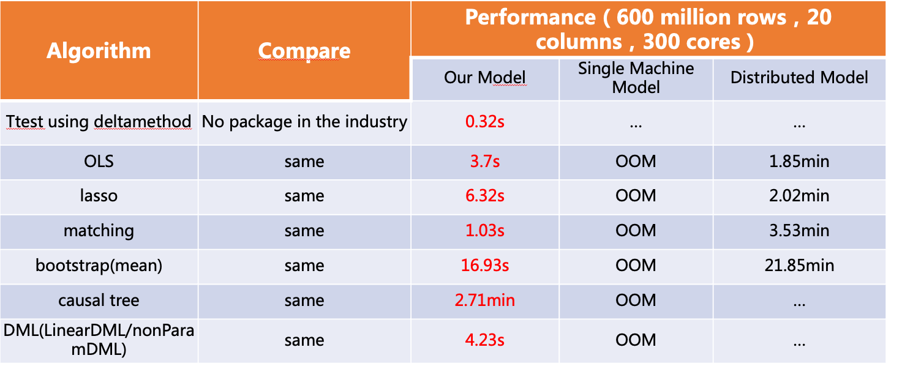
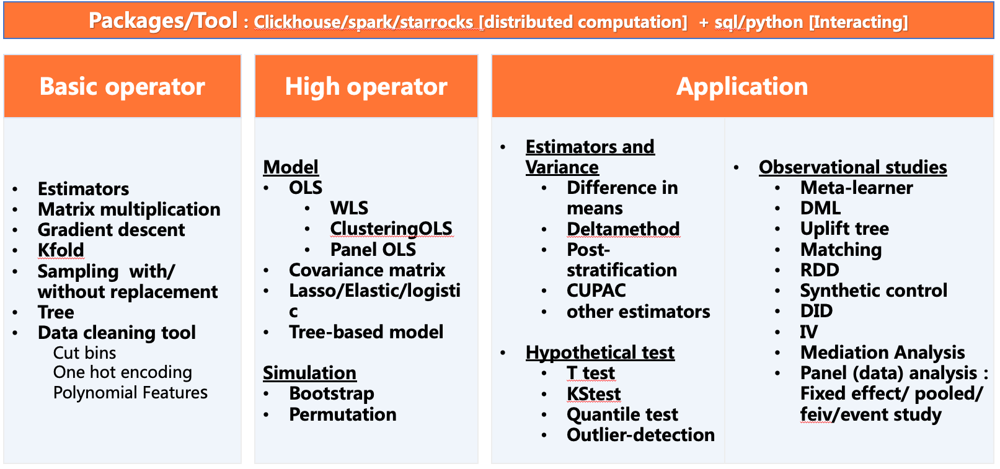
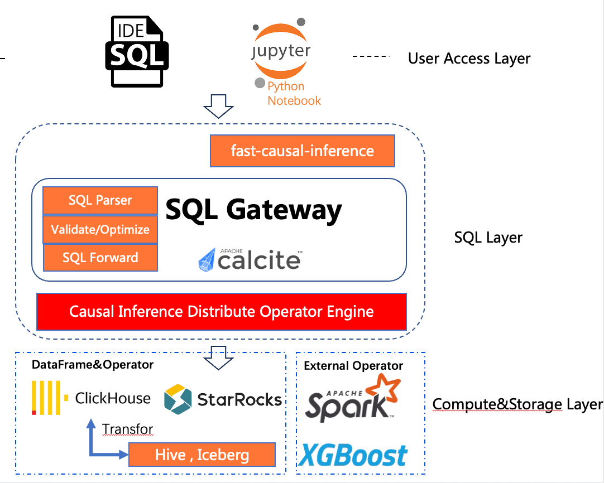

## Fast-Causal-Inference

### Try Fast-Causal-Inference: [Causal Playground](http://xiongjx.cn:8000)
### Fast-Causal-Inference Docs: https://tencent.github.io/fast-causal-inference/docs/
### Introduction
Fast Causal Inference is Tencent's first open-source causal inference project. 
It is an OLAP-based high-performance causal inference (statistical model) computing library, 
which solves the performance bottleneck of existing statistical model libraries (R/Python) under big data, 
and provides causal inference capabilities for massive data execution in seconds and sub-seconds. 
At the same time, the threshold for using statistical models is lowered through the SQL language, 
making it easy to use in production environments. At present, it has supported the causal analysis of WeChat-Search, 
WeChat-Video-Account and other businesses, greatly improving the work efficiency of data scientists.

#### Main advantages of the project:
1. Provides the causal inference capability of second-level and sub-second level execution for massive data
Based on the vectorized OLAP execution engine ClickHouse/StarRocks, the speed is more conducive to the ultimate user experience  

2. Provide basic operators, causal inference capabilities of high-order operators, and upper-level application packaging  
Support ttest, OLS, Lasso, Tree-based model, matching, bootstrap, DML, etc.  

3. Minimalist SQL usage
SQLGateway WebServer lowers the threshold for using statistical models through the SQL language, 
and provides a minimalist SQL usage method on the upper layer, transparently doing engine-related SQL expansion and optimization  

#### The first version already supports the following features:
Basic causal inference tools
1. ttest based on deltamethod, support CUPED
2. OLS, 100 million rows of data, sub-second level

Advanced causal inference tools
1. OLS-based IV, WLS, and other GLS, DID, synthetic control, CUPED, mediation are incubating
2. uplift: minute-level calculation of tens of millions of data
3. Data simulation frameworks such as bootstrap/permutation are being developed to solve the problem of variance estimation without a displayed solution

#### Project application:
Already supported multiple businesses within WeChat, such as WeChat-Video-Account, WeChat-Search, etc.

#### Project open source address
github: https://github.com/Tencent/fast-causal-inference

###  Getting started
##### Preconditions
1. The machine needs to install and start the docker service  
    - Linux:
      - Centos:
        > yum-config-manager --add-repo https://download.docker.com/linux/centos/docker-ce.repo  
          yum install docker-ce  
          systemctl start docker   

      - Ubuntu:
        > sudo apt-get install docker-ce

      - verify docker service status:  
        > systemctl status docker   
    
      - Install docker-compose container service orchestration tool  
        > pip3 install --upgrade pip && pip3 install docker-compose
    - MacOS:  
    reference to https://docs.docker.com/desktop/install/mac-install/, Directly download the .dmg package and double-click to install it,
      Please make sure the docker service is running  
        Add PATH:
        >  echo 'export PATH="/Applications/Docker.app/Contents/Resources/bin:$PATH"' >> ~/.bash_profile && . ~/.bash_profile

    - verify docker service status:  
        > docker ps

##### One-Click Deployment: 
> git clone https://github.com/Tencent/fast-causal-inference  
> cd fast-causal-inference && sh bin/deploy.sh   
> http://127.0.0.1
>>  To start causal analysis, please refer to the built-in demo.ipynb
