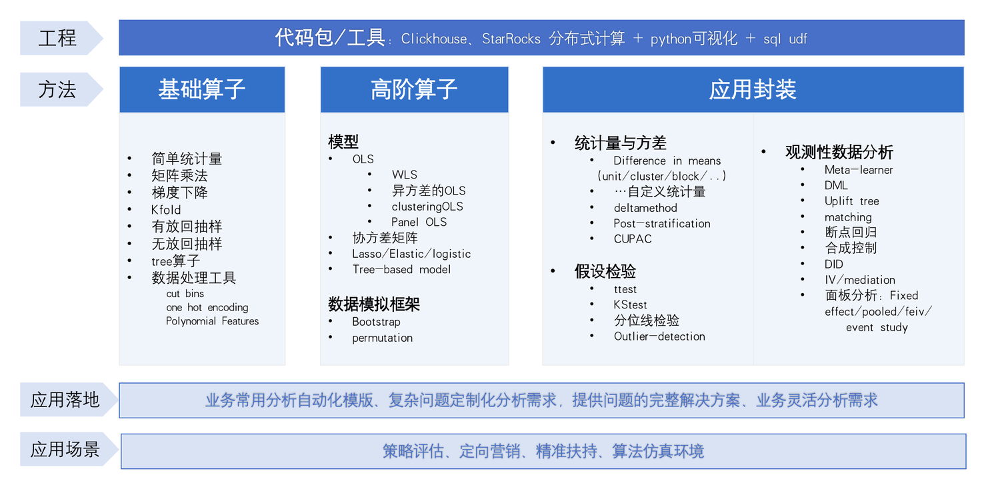
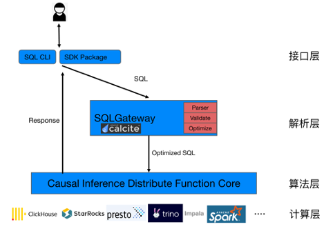

## Fast-Causal-Inference

### Introduction
It is a high-performance causal inference (statistical model) computing 
library based on OLAP, which solves the performance bottleneck of the existing 
statistical model library (R/Python) under big data. At the same time, 
the threshold for using statistical models is lowered through the SQL language, 
making it easy to use in production environments.

###  Feature

###  Docuementations

###  Getting started

Compile From Source  
One-Click Deployment: 
> sh bin/build.sh 

If the following log is displayed, fast-causal-inference is successfully deployed.
> build success

other evironment reference: https://clickhouse.com/docs/en/install#from-sources

###  Change log

###  Support

