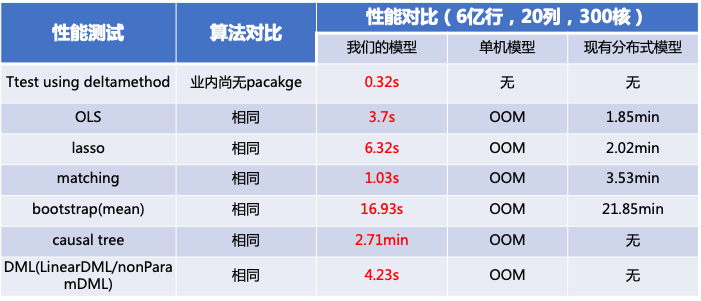
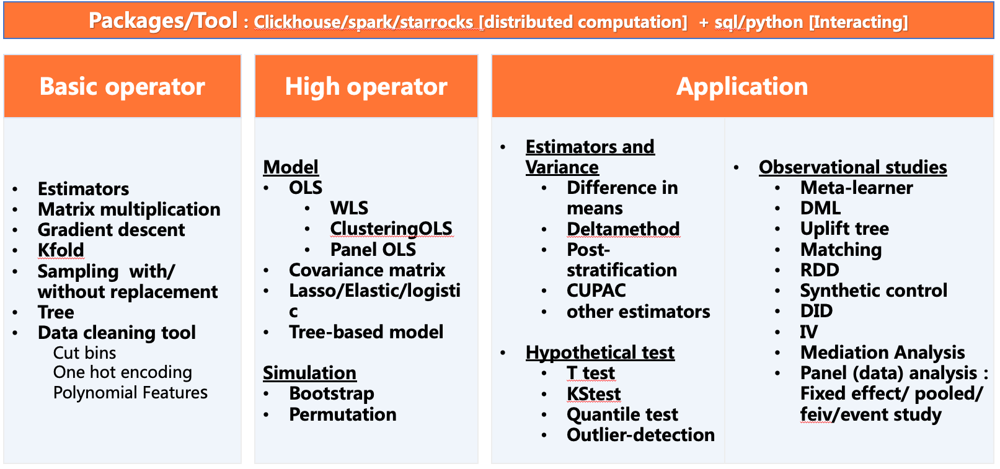
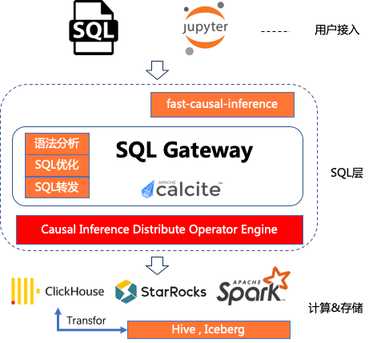

## Fast-Causal-Inference

### Introduction
Fast Causal Inference is Tencent's first open-source causal inference project. 
It is an OLAP-based high-performance causal inference (statistical model) computing library, 
which solves the performance bottleneck of existing statistical model libraries (R/Python) under big data, 
and provides causal inference capabilities for massive data execution in seconds and sub-seconds. 
At the same time, the threshold for using statistical models is lowered through the SQL language, 
making it easy to use in production environments. At present, it has supported the causal analysis of WeChat-Search, 
WeChat-Video-Account and other businesses, greatly improving the work efficiency of data scientists.

#### Main advantages of the project:
1. Provides the causal inference capability of second-level and sub-second level execution for massive data
Based on the vectorized OLAP execution engine ClickHouse/StarRocks, the speed is more conducive to the ultimate user experience  

2. Provide basic operators, causal inference capabilities of high-order operators, and upper-level application packaging  
Support ttest, OLS, Lasso, Tree-based model, matching, bootstrap, DML, etc.  

3. Minimalist SQL usage
SQLGateway WebServer lowers the threshold for using statistical models through the SQL language, 
and provides a minimalist SQL usage method on the upper layer, transparently doing engine-related SQL expansion and optimization  

#### The first version already supports the following features:
Basic causal inference tools
1. ttest based on deltamethod, support CUPED
2. OLS, 100 million rows of data, sub-second level

Advanced causal inference tools
1. OLS-based IV, WLS, and other GLS, DID, synthetic control, CUPED, mediation are incubating
2. uplift: minute-level calculation of tens of millions of data
3. Data simulation frameworks such as bootstrap/permutation are being developed to solve the problem of variance estimation without a displayed solution

#### Project application:
Already supported multiple businesses within WeChat, such as WeChat-Video-Account, WeChat-Search, etc.

#### Project open source address
github: https://github.com/Tencent/fast-causal-inference

###  Getting started

#### Compile From Source Building From Linux Ubuntu
##### One-Click Deployment: 
> sh bin/build.sh 

If the following log is displayed, fast-causal-inference is successfully deployed.
> build success  

#### Examples
use examples data:
> clickhouse client --multiquery < examples/test_data_small.sql  

please refer to the documentation for specific algorithms: [sql_inference](docs/sql_inference.md)

##### Building on Any Linux:  
For other evironment refer to: https://clickhouse.com/docs/en/install#from-sources

##### Running
This will create executable ${deploy_path}/clickhouse which can be used with client or server arguments.
> clickhouse server  
> clickhouse client 

#### Install From Docker Image  
##### Docker Image Pull Command:
> docker pull fastcausalinference/clickhouse-server:23.3-alpine

##### start server instance:
> docker run -d --network=host --name fast-causal-inference-server --ulimit nofile=262144:262144 fastcausalinference/clickhouse-server:23.3-alpine

For more information refer to: docker run --help

##### connect to it from a native client:
> docker exec -it fast-causal-inference-server clickhouse-client

##### stopping / removing the container:
> docker stop fast-causal-inference-server
> docker rm fast-causal-inference-server

#### Examples
use examples data:
> docker exec -i fast-causal-inference-server clickhouse-client --multiquery < examples/test_data_small.sql 

please refer to the documentation for specific algorithms: [sql_inference](docs/sql_inference.md)

#### A Note About Fast-Causal-Reference Project Version
The current version 0.1.0-rc only releases the Fast Causal Inference Clickhouse module, 
and SQLGateway WebServer and Pypi Sdk Package module will be released in version 0.1.0-stable,
planned for august, please pay attention to the version progress.